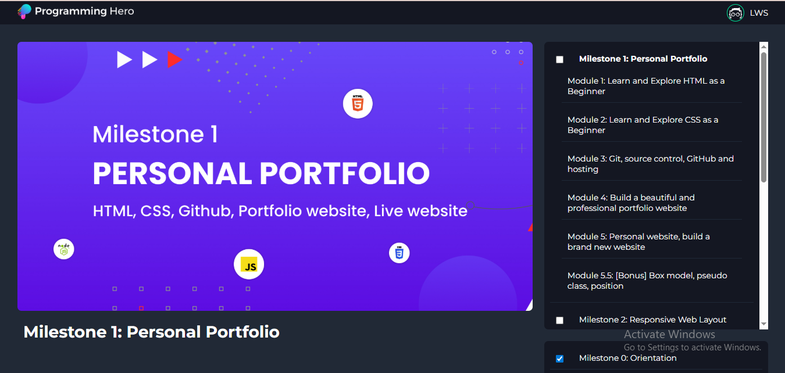

# 📘 Milestone Tracker Project

### 🧩 Overview
This **Milestone Tracker** is a JavaScript-based web application that helps users track their learning or project milestones interactively.  
Each milestone contains multiple modules, and users can expand, view details, and mark them as completed.

---

### 🌐 Live Demo  
👉 **[View Project Here](https://bipul-dev01.github.io/hack-project/)**  

---

### 🖼️ Project Preview  
<p align="center">
  
</p>

---

### 🚀 Features
- 📄 **Dynamic Milestone Loading:** Loads milestone and module data dynamically from a data file (`data.js`).
- ✅ **Mark as Done:** Users can check off milestones to move them to a “Done” list.
- 🔄 **Automatic Sorting:** Both milestone lists (main and done) stay sorted in ascending order by ID.
- 🎨 **Accordion View:** Click on a milestone to expand/collapse and view its modules.
- 🖼️ **Dynamic Image & Description:** Displays corresponding milestone image, title, and description when selected.
- 🌈 **Smooth Transitions:** Hero image fades in smoothly when changed.

---

### 🛠️ Technologies Used
- **HTML5**
- **CSS3**
- **JavaScript (ES6)**
- **Font Awesome (for icons)**

---

### 📂 Project Structure

Milestone-Tracker/
│
├── index.html
├── js/
│ ├── data.js
│ └── main.js
├── images/
│ ├── logo.png
│ ├── lws.png
│ ├── kv.png
│ └── hackProject.png
├── css/
│ └── style.css
└── README.md


---

### ⚙️ How It Works
1. All milestone data is loaded from `data.js` as JSON.
2. JavaScript dynamically generates the milestone cards.
3. Clicking a milestone expands its modules.
4. Checking a box moves it to the “Done” list.
5. Both lists are automatically sorted by milestone ID.

---

### 💡 Future Improvements
- 💾 **Save Progress with LocalStorage**
- 🔍 **Add Search/Filter Functionality**
- 📊 **Add a Progress Bar**
- 🧠 **Use API-based data loading**

---

### 🧭 Run Locally
To run this project on your local machine:

```bash
# Clone this repository
git clone https://github.com/Bipul-dev01/hack-project.git

# Go into the project folder
cd hack-project

# Open index.html in your browser

👨‍💻 Author

Tajul Islam Bipul
Web Designer & Developer
📍 Bangladesh
📞 +8801712-602914
🌐 Live Project

💻 GitHub Profile
